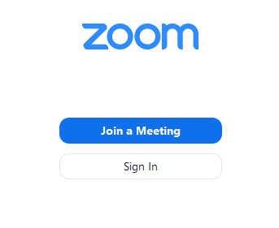

```{r setup, include=FALSE}
knitr::opts_chunk$set(echo = FALSE)
```

### Setting up your Zoom account

All UIC students are equipped with a licensed Zoom account via their UIC email. [Head here to set up and configure your account.](https://uic.zoom.us/) Once you sign in with your NetID you should be good to go!

### Downloading Zoom software

To get the app for your computer, tablet or phone, use the appropriate links below:

+ [Zoom for Computer (Windows or Mac)](https://zoom.us/support/download)
+ [Zoom for iPhone or iPad](https://itunes.apple.com/us/app/id546505307)
+ [Zoom for Android devices](https://play.google.com/store/apps/details?id=us.zoom.videomeetings)

### Launching Zoom

Once you launch Zoom on your device, you'll see the following screen:
```{r, out.width='50%', fig.align='center', fig.cap='...'}

```

Go ahead and sign in using your UIC credentials (NetID and password). Once you login, you'll see the following "home" screen. 

```{r, out.width='75%', fig.align='center', fig.cap='...'}
knitr::include_graphics('images/home-screen.png')
```

From here, you can do the following:

+ Begin a new meeting with your personal pin or a randomized pin by pressing "New Meeting"
+ Join a meeting by pressing "Join" and entering the meeting ID and password. (**This is how you will join and enter drop-in hours and discussion sessions.**)
+ Schedule a meeting
+ Share your screen in a meeting by clicking "Share screen" and entering the meeting ID

### Using Zoom functions
Once you join a meeting, you will see the following tool bar at the bottom of your screen:

```{r, out.width='100%', fig.align='center', fig.cap='...'}

```

+ Pressing "Mute" or "Unmute" turns your microphone off and on
+ Pressing "Start video" turns your computer camera on
+ "Participants" allows you to see other participants and do things like "raise your hand"
+ Chats can be sent to the group or to individual members
+ "Reactions" provides two emojis which you can display on your screen for non-verbal feedback

